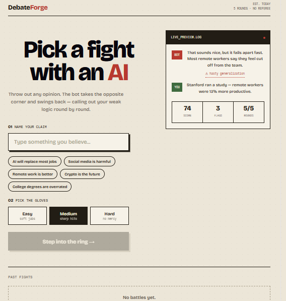
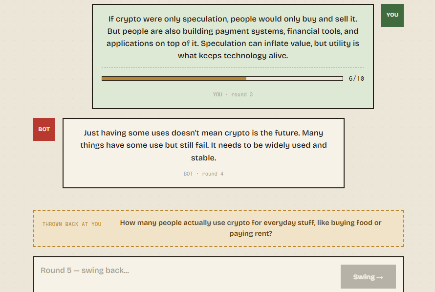
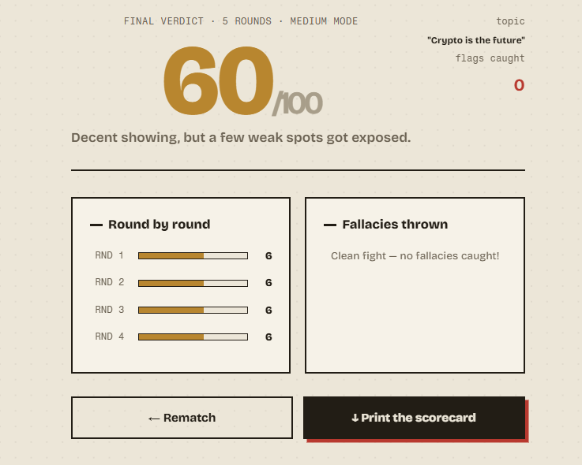

# DebateForge


An AI that argues against whatever you believe.

**[Live Demo](https://debate-forge-nine.vercel.app)**

> First load may take 30–50 seconds. The backend runs on a free tier and spins down with inactivity.

---

## What is this?

Most AI tools are built to agree with you. DebateForge does the opposite. Submit any opinion and an adversarial AI takes the hardest possible counter-position, pushes back for 5 rounds, flags your logical fallacies as you make them, and scores your argument strength round by round.

---

## Why I built this

Critical thinking erodes when everything around you is designed to validate what you already believe. I wanted to build the opposite of a chatbot that agrees with you — something that genuinely stress-tests your reasoning the way a sharp debate opponent would.

The hardest engineering problem wasn't the AI integration. It was getting the model to be consistently adversarial without becoming incoherent, designing a structured JSON contract that reliably extracts fallacy data across wildly different topics, and building a scoring system that produces meaningful per-round feedback.

---

## Screenshots

### Landing Page


### Debate Arena


### Final Report


---

## Features

**Adversarial debate engine**
The AI takes the opposite position on any topic and maintains it for 5 full rounds. It does not soften, agree, or congratulate — it pushes back every time.

**Logical fallacy detection**
After each user argument, the AI identifies any logical fallacy committed — hasty generalization, false dilemma, appeal to authority, straw man, and others — with a plain-English explanation shown inline.

**Argument strength scoring**
Every round, the AI scores the user's argument from 1 to 10 based on evidence, reasoning quality, and clarity. Scores aggregate into a final verdict out of 100.

**Live strength meter**
A client-side heuristic estimates argument strength while the user types — before sending. Built with keyword detection and length analysis. Zero API calls, instant feedback.

**Final verdict report**
After 5 rounds: overall score, round-by-round strength chart, full list of fallacies caught, and a one-line verdict.

**PDF export**
Server-side PDF generation using ReportLab. Exports a formatted scorecard with round scores and full debate transcript.

**Debate history**
Past debates are saved to localStorage and can be reopened to review the full transcript and scores.

**Difficulty modes**
Easy, Medium, and Hard — each changes the AI's aggression level and tone through the system prompt.

---

## Architecture
User (Browser)

|

v

React Frontend  →  Vercel CDN

|

| REST API (JSON)

v

FastAPI Backend  →  Render

|

v

Groq API  (Llama 3.3 70B)

|

v

Structured JSON response

{ argument, fallacy, counterquestion, strength_score }

|

|-- Scoring engine

|-- PDF generator (ReportLab)

`-- localStorage history
---

## API Reference

### POST /debate

Accepts the user's argument and the full conversation history. Returns an adversarial AI response.

Request:
```json
{
  "topic": "AI will replace most jobs",
  "user_argument": "Studies show productivity increases significantly with AI tools"
}
```

Response:
```json
{
  "reply": "{\"argument\": \"Productivity gains don't equal job replacement...\", \"fallacy\": {\"name\": \"Hasty Generalization\", \"explanation\": \"One study doesn't prove a universal trend\"}, \"counterquestion\": \"Which jobs specifically have been eliminated rather than changed?\", \"strength_score\": 6}"
}
```

### POST /export-pdf

Accepts full debate data, returns a formatted PDF as a binary stream.

Request fields: `topic`, `mode`, `final_score`, `avg_score`, `fallacies`, `messages`, `round_scores`

Response: `application/pdf` — triggers browser download

---

## Performance

Frontend loads instantly from Vercel's global CDN.

Backend cold start is 30–50 seconds on the free Render tier due to spin-down after inactivity. Subsequent requests respond normally.

The live argument strength meter runs entirely client-side with no API calls, so feedback is instant while typing.

Debate history uses localStorage — no database, no network request, no latency.

Full conversation history is passed to the LLM on every round, giving the model genuine multi-turn memory without a separate memory layer.

---

## Tech Stack

Frontend: React 18, Vite, custom CSS (no UI framework)

Backend: FastAPI, Python, Groq API (Llama 3.3 70B), ReportLab, Pydantic

Infrastructure: Vercel (frontend), Render (backend), GitHub

---

## Project Structure
debateforge/

├── backend/

│   ├── main.py

│   ├── requirements.txt

│   └── .env                 # not committed

├── frontend/

│   ├── .env                 # not committed

│   └── src/

│       ├── App.jsx

│       ├── App.css

│       ├── api/

│       │   └── debate.js

│       ├── utils/

│       │   ├── history.js

│       │   └── estimateStrength.js

│       └── components/

│           ├── Landing.jsx

│           ├── Arena.jsx

│           └── Report.jsx

└── screenshots/
---

## Running Locally

### Backend

```bash
cd backend
python -m venv venv
venv\Scripts\activate
pip install -r requirements.txt
```

Create `backend/.env`:
GROQ_API_KEY=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
Free Groq API key at [console.groq.com](https://console.groq.com)

```bash
uvicorn main:app --reload
```

### Frontend

```bash
cd frontend
npm install
```

Create `frontend/.env`:
VITE_API=http://localhost:8000
```bash
npm run dev
```

Open `http://localhost:5173`

---

## Resume Highlights

- Built and deployed a full-stack AI application end-to-end
- Engineered an adversarial system prompt with a structured JSON response contract for consistent fallacy extraction across any topic
- Implemented multi-turn conversational memory by passing full debate history to the LLM on every round
- Designed a client-side argument strength heuristic for zero-latency live feedback with no API calls
- Built a server-side PDF generation pipeline with formatted scorecard and full transcript
- Configured CORS, environment variable separation, and production deployment across Vercel and Render

---

## What's Next

- Shareable debate links with server-side persistence
- AI Coach mode — post-debate feedback that rewrites your weakest argument
- Socratic, Lawyer, and Professor opponent personas

---

## License

MIT — built by [Ashmitha148](https://github.com/Ashmitha148)